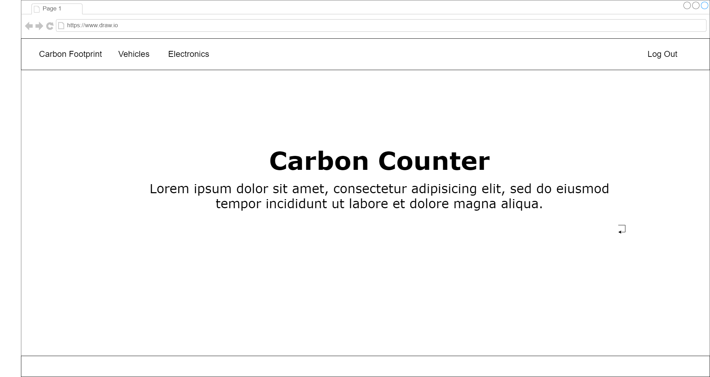
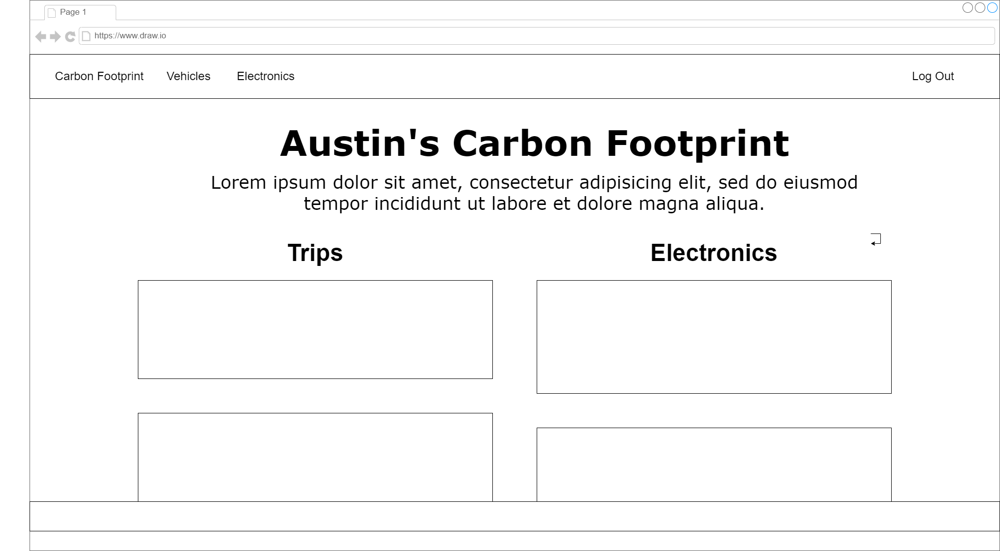

# **_Carbon Counter_**

## Date: 7/6/2023

### Author: [Austin Showen](https://github.com/austin-showen)

### [Trello Board](https://trello.com/b/aU2H0Ynd/carbon-counter)

---

### **_Description_**

**A full-stack MERN application allowing users to calculate and track their carbon footprint.**

---

### **_Technologies_**

- MongoDB
- Express
- React
- Node.js
- JavaScript
- HTML
- CSS

---

### **_About the App_**

#### Carbon Counter is a web app designed to give users insight into their carbon footprint. Accessing data through the [Carbon Interface API](https://docs.carboninterface.com/#/), Carbonator allows authenticated users to register their vehicles and electronic appliances, then calculate the carbon emissions generated through their use.

#### Specifications (MVP):

- The home page provides the option to sign up or log in via hand-rolled JWT authentication.
- **Authenticated users can:**
    - Register their own vehicles and save them to the MongoDB database. The Carbon Interface API has carbon usage statistics for thousands of vehicle models, so the user's vehicles will have to match with the data available on the API.
    - Input a trip length in miles and calculate the carbon emissions from that trip, then save the trip to the database.
    - Register their own electronic appliances (computers, air conditioners, kitchen appliances...).
    - Calculate the carbon emissions from using their appliances for a chosen duration, then save the activity to the database.
    - Register their country and state. Carbon Interface calculates carbon emissions based on the energy profile of individual states, so this will give more accurate calculations.
    - View the carbon emissions for all previous trips and activities, as well as graphs of their overall carbon footprint.
    - Edit and delete vehicles, appliances, trips, and activities.
- **Unauthenticated users can:**
    - Access a small number of example vehicles.
    - Input a trip length in miles and calculate the carbon emissions from driving an example vehicle that distance.
    - Access a small number of example electronic appliances.
    - Input an activity duration in hours/minutes and calculate the carbon emissions from using an example appliance for that duration.

---

### **_Entity Relationship Diagram_**

#### 

---

### **_Component Hierarchy Diagram_**

#### 

---

### Wireframes

#### Home Page Wireframe
#### 

#### Carbon Footprint Page Wireframe
#### 

---

### **_Stretch Goals (Post-MVP)_**

- [ ] Using additional functionality from the Carbon Interface API, users can calculate the carbon emissions of flights.
- [ ] Users can calculate the carbon emissions of shipping packages.
- [ ] Users can view charts and diagrams of their carbon footprint.
- [ ] Trips and activities include a date so users can visualize their carbon usage trends over time.
- [ ] The application integrates a front-end API for styling.

---

### **_Credits_**

[Carbon Interface API](https://docs.carboninterface.com/#/)
