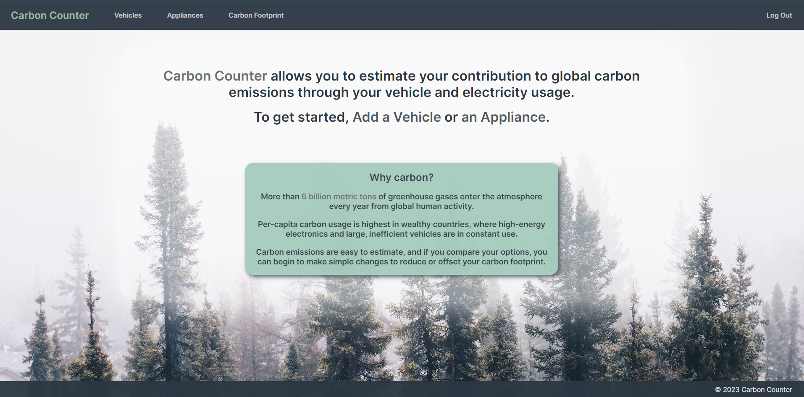
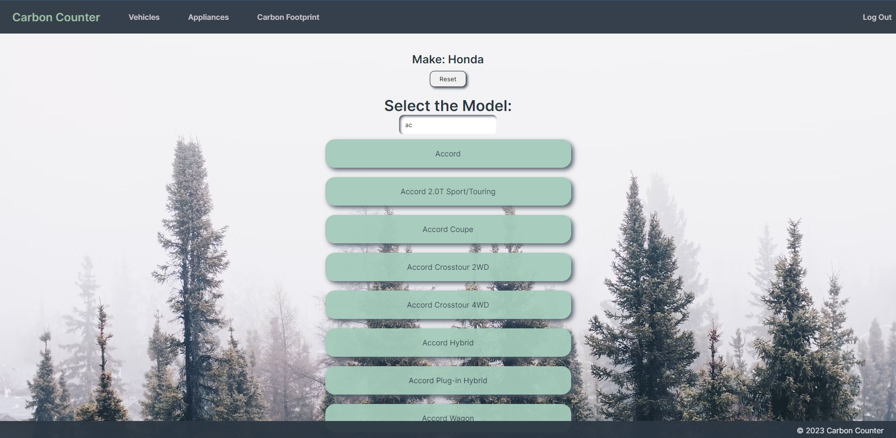
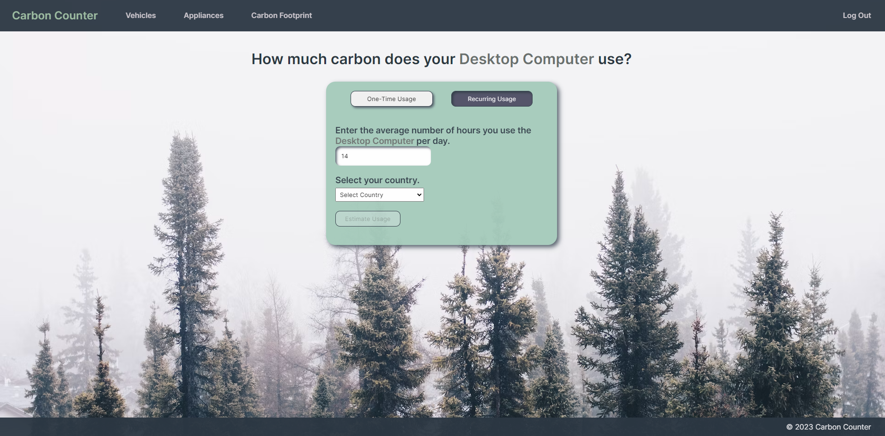
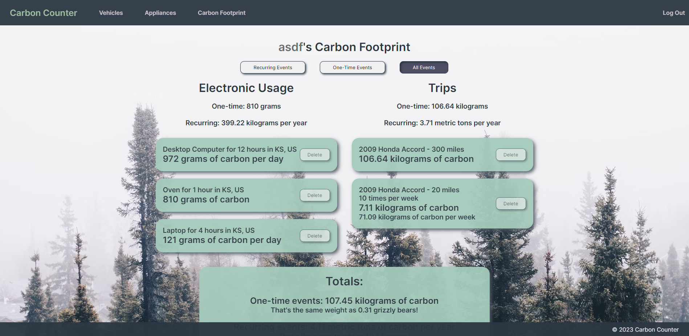
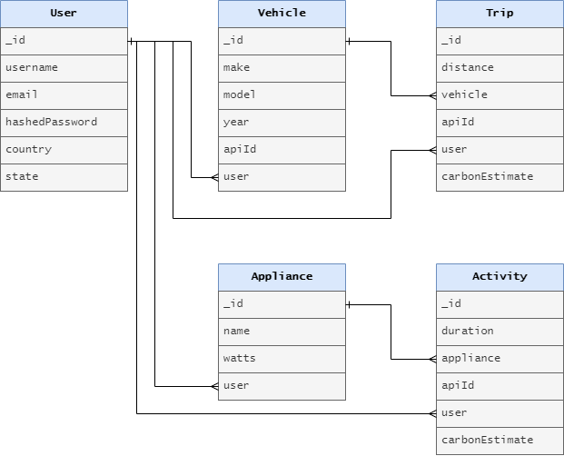
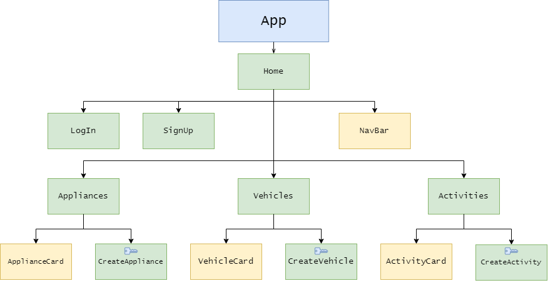

# **_[Carbon Counter](https://carbon-counter.vercel.app)_**

## Date: 7/6/2023

### Author: [Austin Showen](https://github.com/austin-showen)

### [Trello Board](https://trello.com/b/aU2H0Ynd/carbon-counter)

---

### **_Description_**

**A full-stack MERN application allowing users to calculate their carbon emissions through vehicle and electricity use..**

---

### **_Technologies_**

- MongoDB
- Express
- React
- Node.js
- JavaScript
- HTML
- CSS

---

### **_About the App_**

#### Carbon Counter is a web app designed to give users insight into their carbon footprint. Accessing data through the [Carbon Interface API](https://docs.carboninterface.com/#/), Carbon Counter allows authenticated users to register their vehicles and electronic appliances, then calculate the carbon emissions generated through their use.

#### Specifications:

- The home page provides the option to sign up or log in via hand-rolled JWT authentication.
- Authenticated users can:
    - Select a vehicle make, model, and year from the Carbon Interface API, register the vehicle, and save it to the local MongoDB database.
         - While selecting vehicle details, the options dynamically render onscreen in reponse to keypresses.
    - Input a trip length in miles and calculate the carbon emissions from that trip, then save the trip to the database.
    - Register their own electronic appliances (computers, air conditioners, kitchen appliances...) given the approximate wattage.
    - Calculate the carbon emissions from using their appliances for a chosen duration in a chosen country and state, then save the activity to the database.
    - View the carbon emissions for all previous trips and activities.
    - Register a trip or electricity usage as one-time or recurring.
    - Filter the previously registered trips by one-time or recurring.
    - Edit and delete vehicles, appliances, trips, and electricity usages.

---

### Screenshots

#### Home Page
#### 

#### Add Vehicle Form
#### 

#### Add Usage Form
#### 

#### Carbon Footprint Page
#### 

---

### **_Entity Relationship Diagram_**

#### 

---

### **_Component Hierarchy Diagram_**

#### 

---

### **_Future Goals_**

- [ ] Using additional functionality from the Carbon Interface API, users can calculate the carbon emissions of flights.
- [ ] Users can calculate the carbon emissions of shipping packages.
- [ ] Users can view charts and diagrams of their carbon footprint.
- [ ] Trips and activities include a date so users can visualize their carbon usage trends over time.

---

### **_Credits_**

[Carbon Interface API](https://docs.carboninterface.com/#/)
